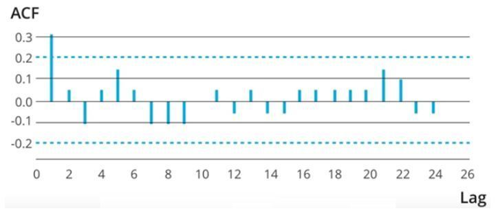
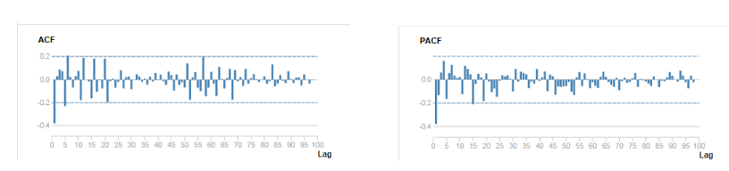

<h1 align="center">Module 4 Assessment</h1>

## Overview

This assessment is designed to test your understanding of the Mod 4 material. It covers:

* Bayes Theorem
* Calculus, Cost Function, and Gradient Descent
* Extensions to Linear Models
* Time Series


Read the instructions carefully. You will be asked both to write code and respond to a few short answer questions.

### Note on the short answer questions

For the short answer questions please use your own words. The expectation is that you have not copied and pasted from an external source, even if you consult another source to help craft your response. While the short answer questions are not necessarily being assessed on grammatical correctness or sentence structure, do your best to communicate yourself clearly.

## Part 1: Bayesian Statistics [Suggested time: 15 minutes]
### a. Bayes' Theorem

Thomas wants to get a new puppy 🐕 🐶 🐩 


He can choose to get his new puppy either from the pet store or the pound. The probability of him going to the pet store is $0.2$. 

He can choose to get either a big, medium or small puppy.

If he goes to the pet store, the probability of him getting a small puppy is $0.6$. The probability of him getting a medium puppy is $0.3$, and the probability of him getting a large puppy is $0.1$.

If he goes to the pound, the probability of him getting a small puppy is $0.1$. The probability of him getting a medium puppy is $0.35$, and the probability of him getting a large puppy is $0.55$.

4.a.1) What is the probability of Thomas getting a small puppy?
4.a.2) Given that he got a large puppy, what is the probability that Thomas went to the pet store?
4.a.3) Given that Thomas got a small puppy, is it more likely that he went to the pet store or to the pound?
4.a.4) For Part 2, what is the prior, posterior and likelihood?

ans1 = None
ans2 = None
ans3 = "answer here"
ans4_prior = "answer here"
ans4_posterior = "answer here"
ans4_likelihood = "answer here"

---
## Part 2: Calculus, Cost Function, and Gradient Descent [Suggested Time: 15 min]
---


The best fit line that goes through the scatterplot up above can be generalized in the following equation: $$y = mx + b$$

Of all the possible lines, we can prove why that particular line was chosen using the plot down below:


where RSS is defined as the residual sum of squares:

$$ 
\begin{align}
RSS &= \sum_{i=1}^n(actual - expected)^2 \\
&= \sum_{i=1}^n(y_i - \hat{y})^2 \\
&= \sum_{i=1}^n(y_i - (mx_i + b))^2
\end{align}
$$ 

### 1. What is a more generalized name for the RSS curve above? How is it related to machine learning models?


```python
# Your answer here
```

### 2. Would you rather choose a $m$ value of 0.08 or 0.05 from the RSS curve up above?   What is the relation between the position on the cost curve, the error, and the slope of the line?


```python
# Your answer here
```


### 3. Using the gradient descent visual from above, explain why the distance between each step is getting smaller as more steps occur with gradient descent.


```python
# Your answer here
```

### 4. What is the purpose of a learning rate in gradient descent? Explain how a very small and a very large learning rate would affect the gradient descent.


```python
# Your answer here
```

---
## Part 3: Extensions to Linear Regression [Suggested Time: 20 min]
---

In this section, you're going to be creating linear models that are more complicated than a simple linear regression. In the cells below, we are importing relevant modules that you might need later on. We also load and prepare the dataset for you.


```python
import pandas as pd
import itertools
import seaborn as sns
import matplotlib.pyplot as plt
%matplotlib inline
import seaborn as sns
import numpy as np
from sklearn.linear_model import Lasso, Ridge
import pickle
from sklearn.metrics import mean_squared_error, roc_curve, roc_auc_score, accuracy_score
from sklearn.linear_model import LinearRegression, LogisticRegression
from sklearn.model_selection import train_test_split
from sklearn.preprocessing import PolynomialFeatures
from sklearn.preprocessing import StandardScaler
```


```python
data = pd.read_csv('raw_data/advertising.csv').drop('Unnamed: 0',axis=1)
data.describe()
```


```python
X = data.drop('sales', axis=1)
y = data['sales']
```


```python
# split the data into training and testing set. Do not change the random state please!
X_train , X_test, y_train, y_test = train_test_split(X, y,random_state=2019)
```

### 1. We'd like to add a bit of complexity to the model created in the example above, and we will do it by adding some polynomial terms. Write a function to calculate train and test error for different polynomial degrees.

This function should:
* take `degree` as a parameter that will be used to create polynomial features to be used in a linear regression model
* create a PolynomialFeatures object for each degree and fit a linear regression model using the transformed data
* calculate the mean square error for each level of polynomial
* return the `train_error` and `test_error` 


```python
def polynomial_regression(degree):
    """
    Calculate train and test errorfor a linear regression with polynomial features.
    (Hint: use PolynomialFeatures)
    
    input: Polynomial degree
    output: Mean squared error for train and test set
    """
    # // your code here //
    
    train_error = None
    test_error = None
    return train_error, test_error
```

#### Try out your new function


```python
polynomial_regression(3)
```

#### Check your answers

MSE for degree 3:
- Train: 0.2423596735839209
- Test: 0.15281375973923944

MSE for degree 4:
- Train: 0.18179109317368244
- Test: 1.9522597174462015

### 2. What is the optimal number of degrees for our polynomial features in this model? In general, how does increasing the polynomial degree relate to the Bias/Variance tradeoff?  (Note that this graph shows RMSE and not MSE.)


<!---
fig, ax = plt.subplots(figsize=(7, 7))
degree = list(range(1, 10 + 1))
ax.plot(degree, error_train[0:len(degree)], "-", label="Train Error")
ax.plot(degree, error_test[0:len(degree)], "-", label="Test Error")
ax.set_yscale("log")
ax.set_xlabel("Polynomial Feature Degree")
ax.set_ylabel("Root Mean Squared Error")
ax.legend()
ax.set_title("Relationship Between Degree and Error")
fig.tight_layout()
fig.savefig("visuals/rsme_poly.png",
            dpi=150,
            bbox_inches="tight")
--->


```python
# Your answer here
```

### 3. In general what methods would you can use to reduce overfitting and underfitting? Provide an example for both and explain how each technique works to reduce the problems of underfitting and overfitting.


```python
# Your answer here
```

### 4. What is the difference between the two types of regularization for linear regression?


```python
# Your answer here
```

### 5. Why is scaling input variables a necessary step before regularization?


```python
# Your answer here
```

## Time Series: Part 4 [Suggested Time: 10 minutes]

### 1. Which of the following can’t be a component for a time series plot?
A) Seasonality <br>
B) Trend <br>
C) Cyclical <br>
D) Noise<br>
E)  None of the above


```python
# Your answer here
```


### 2) What does autocovariance measure?

A) Linear dependence between multiple points on the different series observed at different times<br>
B) Quadratic dependence between two points on the same series observed at different times<br>
C) Linear dependence between two points on different series observed at same time<br>
D) Linear dependence between two points on the same series observed at different times<br>

```python
# Your answer here
```
### 3) Looking at the below ACF plot, would you suggest to apply AR or MA in ARIMA modeling technique?



A) AR<br>
B) MA <br>
C) Can’t Say <br>


```python
# Your answer here
```
### 4) Stationarity is a desirable property for a time series process.

A) TRUE <br>
B) FALSE <br>

```python
# Your answer here
```
### 5) Which of the following statement is correct?

1. If autoregressive parameter (p) in an ARIMA model is 1, it means that there is no auto-correlation in the series.

2. If moving average component (q) in an ARIMA model is 1, it means that there is auto-correlation in the series with lag 1.

3. If integrated component (d) in an ARIMA model is 0, it means that the series is not stationary.

A) Only 1 <br>
B) Both 1 and 2 <br>
C) Only 2 <br>
D)  All of the statements <br>


```python
# Your answer here
```
### 6) BIC penalizes complex models more strongly than the AIC. 

A) TRUE <br>
B) FALSE <br>


```python
# Your answer here
```
### 7) How many AR and MA terms should be included for the time series by looking at the above ACF and PACF plots?





A) AR (1) MA(0) <br>
B) AR(0)MA(1) <br>
C) AR(2)MA(1) <br>
D) AR(1)MA(2) <br>
E) Can’t Say <br>

```python
# Your answer here
```
